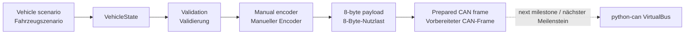

# Virtual CAN ECU Validation

[](https://github.com/YOUR_USERNAME/virtual-can-ecu-validation/actions/workflows/tests.yml)

An incremental, requirements-based learning project for automotive CAN
communication and virtual ECU validation.

Ein schrittweise aufgebautes, anforderungsbasiertes Lernprojekt zu
automobiler CAN-Kommunikation und virtueller ECU-Validierung.

> **Current status / Aktueller Stand:** Milestone 0.1 — application data,
> manual signal encoding, payload decoding and CAN-frame preparation. No bus
> transmission is implemented yet. / Meilenstein 0.1 — Anwendungsdaten,
> manuelle Signalcodierung, Nutzdatendecodierung und CAN-Frame-Vorbereitung.
> Eine Busübertragung ist noch nicht implementiert.

## Project idea / Projektidee

The repository grows together with the theory. Each studied CAN concept becomes
a small, documented and tested project increment. This prevents the repository
from claiming tools or experience that have not yet been learned.

Das Repository wächst gemeinsam mit der Theorie. Jedes behandelte CAN-Konzept
wird zu einer kleinen, dokumentierten und getesteten Projekterweiterung. Dadurch
behauptet das Repository keine Werkzeuge oder Erfahrungen, die noch nicht
erarbeitet wurden.

## Current functionality / Aktuelle Funktionalität

The first version can:

- represent physical vehicle values in a typed `VehicleState`;
- validate the documented physical ranges;
- manually convert physical signals to raw values using factor and offset;
- pack the raw values into an eight-byte Classic CAN payload;
- prepare the payload with standard identifier `0x100`;
- decode the payload back into physical values;
- verify the behavior with automated tests.

Die erste Version kann:

- physikalische Fahrzeugwerte in einem typisierten `VehicleState` darstellen;
- die dokumentierten physikalischen Wertebereiche prüfen;
- physikalische Signale mithilfe von Faktor und Offset manuell in Rohwerte umrechnen;
- die Rohwerte in eine acht Byte lange Classic-CAN-Nutzlast packen;
- die Nutzlast mit dem Standard-Identifier `0x100` vorbereiten;
- die Nutzlast wieder in physikalische Werte decodieren;
- das Verhalten mit automatisierten Tests verifizieren.

## Architecture / Architektur



See [Architecture / Architektur](docs/architecture.md) for the design decision
behind the manual first encoder.

## Example / Beispiel

Input / Eingang:

```text
Vehicle speed / Fahrzeuggeschwindigkeit: 123.45 km/h
Brake pressed / Bremse betätigt: true
Accelerator pedal / Fahrpedalstellung: 20.0 %
Motor temperature / Motortemperatur: 70 °C
```

Prepared communication data / Vorbereitete Kommunikationsdaten:

```text
Identifier: 0x100
Payload:    39 30 01 32 6E 00 00 00
```

## Installation

Python 3.11 or newer is required. / Python 3.11 oder neuer wird benötigt.

### Windows PowerShell

```powershell
python -m venv .venv
.venv\Scripts\Activate.ps1
python -m pip install --upgrade pip
pip install -e ".[dev]"
```

### Linux or macOS

```bash
python -m venv .venv
source .venv/bin/activate
python -m pip install --upgrade pip
pip install -e ".[dev]"
```

## Run the demonstration / Demonstration ausführen

```bash
python -m virtual_can_validation
```

After installation, this command is also available:

Nach der Installation steht auch dieser Befehl zur Verfügung:

```bash
can-demo
```

## Run the tests / Tests ausführen

```bash
pytest --cov=virtual_can_validation --cov-report=term-missing
```

## Repository structure / Repository-Struktur

```text
virtual-can-ecu-validation/
├── .github/workflows/       # Continuous integration / CI
├── docs/
│   ├── learning_notes/      # Bilingual theory notes / Zweisprachige Lernnotizen
│   ├── architecture.md
│   ├── github_setup.md
│   └── project_learning_map.md
├── requirements/            # Testable project requirements / Testbare Anforderungen
├── src/virtual_can_validation/
├── tests/
├── LICENSE
├── pyproject.toml
└── README.md
```

## Learning notes / Lernnotizen

1. [CAN 01 — Fundamentals / Grundlagen](docs/learning_notes/01_can_fundamentals/CAN_01_Fundamentals.md)

The complete sequence and its planned code increments are documented in the
[Learning-to-Project Map / Zuordnung von Lernstoff und Projekt](docs/project_learning_map.md).

## Requirements / Anforderungen

The current behavior is grounded in a small set of bilingual, testable
requirements:

Das aktuelle Verhalten basiert auf einer kleinen Gruppe zweisprachiger,
testbarer Anforderungen:

- [Initial Requirements / Erste Anforderungen](requirements/initial_requirements.md)

## Important limitations / Wichtige Einschränkungen

This educational milestone does **not** yet provide:

- physical CAN hardware or electrical behavior;
- a `python-can` virtual bus;
- real CAN arbitration or bit timing;
- cyclic transmission or communication timeouts;
- a DBC file or `cantools` integration;
- a physical ECU, production SIL environment or HIL test bench;
- functional-safety compliance.

Dieser Lernmeilenstein bietet **noch nicht**:

- physikalische CAN-Hardware oder elektrisches Verhalten;
- einen virtuellen Bus mit `python-can`;
- reale CAN-Arbitrierung oder Bit-Timing;
- zyklische Übertragung oder Kommunikations-Timeouts;
- eine DBC-Datei oder `cantools`-Integration;
- ein physikalisches Steuergerät, eine produktive SIL-Umgebung oder einen HIL-Prüfstand;
- Functional-Safety-Konformität.

## Planned toolchain / Geplante Toolchain

Tools are added only when their related theory is studied:

Werkzeuge werden erst ergänzt, wenn die zugehörige Theorie behandelt wurde:

- Python and `pytest` — current / aktuell
- `python-can` — virtual send and receive / virtuelles Senden und Empfangen
- `cantools` and DBC — network-description-based encoding / DBC-basierte Codierung
- GitHub Actions — automated regression tests / automatisierte Regressionstests

## Official references / Offizielle Referenzen

- [python-can documentation](https://python-can.readthedocs.io/en/stable/)
- [cantools documentation](https://cantools.readthedocs.io/en/stable/)
- [pytest documentation](https://docs.pytest.org/en/stable/)
- [GitHub Actions: Building and testing Python](https://docs.github.com/en/actions/tutorials/build-and-test-code/python)

## License / Lizenz

This project is available under the MIT License. / Dieses Projekt steht unter
der MIT-Lizenz.
