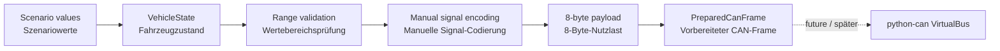

# Architecture / Architektur

## Current milestone 0.1 / Aktueller Meilenstein 0.1

The software currently models the boundary between physical application data
and CAN communication data. It prepares a CAN identifier and payload but does
not yet place bits on a physical or virtual bus.

Die Software modelliert aktuell die Grenze zwischen physikalischen
Anwendungsdaten und CAN-Kommunikationsdaten. Sie bereitet einen CAN-Identifier
und die Nutzdaten vor, überträgt jedoch noch keine Bits auf einem physikalischen
oder virtuellen Bus.

## Why the first encoder is manual / Warum der erste Encoder manuell ist

The explicit implementation makes scaling, offset, quantization, byte order and
bit placement visible. After the DBC lesson, the project will add a DBC file and
`cantools`, then verify that both implementations produce equivalent payloads.

Die explizite Implementierung macht Skalierung, Offset, Quantisierung,
Byte-Reihenfolge und Bitbelegung sichtbar. Nach der DBC-Lerneinheit ergänzt das
Projekt eine DBC-Datei und `cantools` und überprüft anschließend, ob beide
Implementierungen äquivalente Nutzdaten erzeugen.
