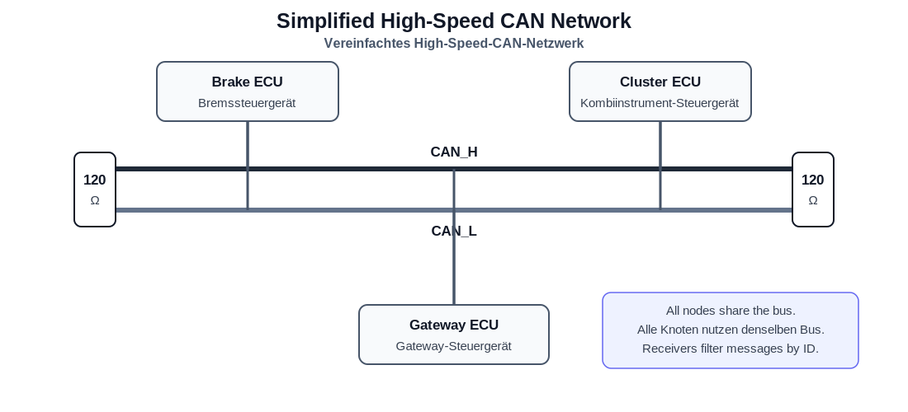
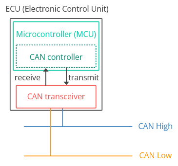
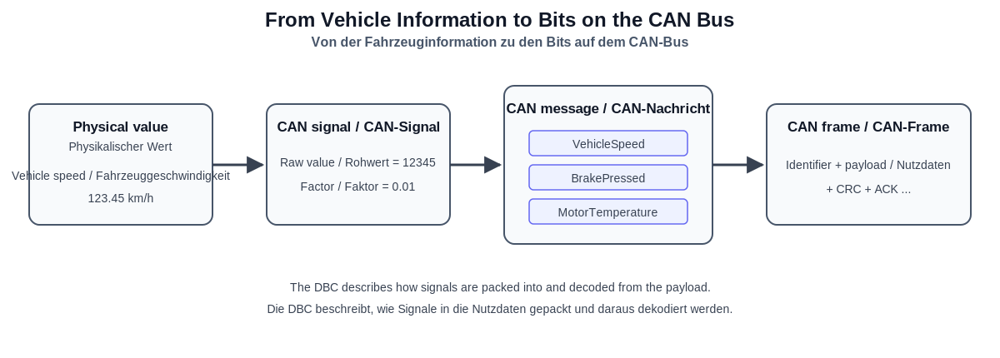
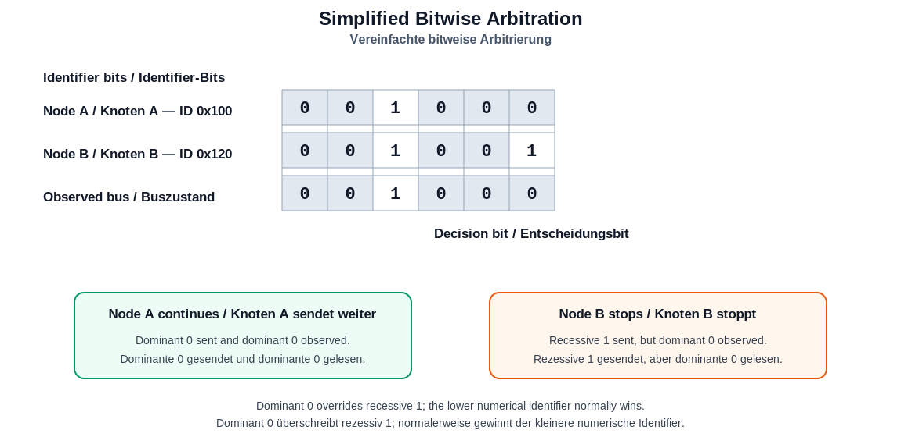
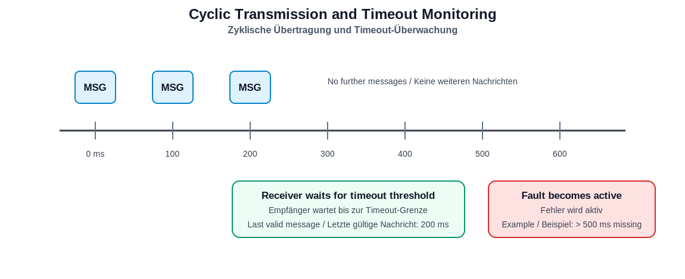
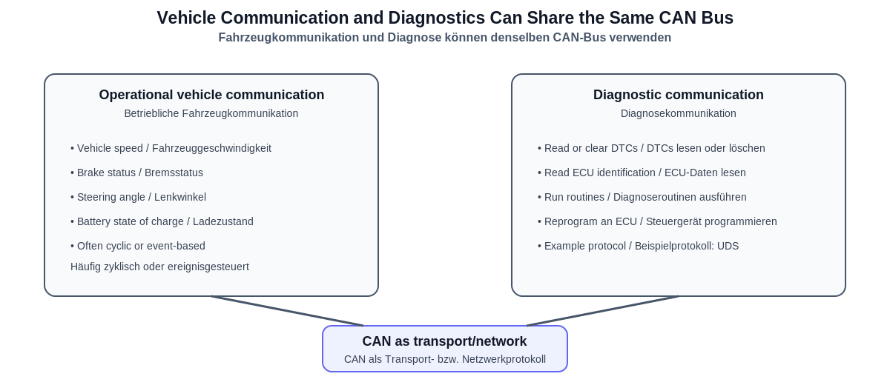

# CAN 01 — Fundamentals / Grundlagen

> **Learning goal / Lernziel:** Understand why CAN is used, how a CAN network is organized, how information is represented, and how messages obtain access to the shared bus.

> Verstehen, warum CAN eingesetzt wird, wie ein CAN-Netzwerk aufgebaut ist, wie Informationen dargestellt werden und wie Nachrichten Zugriff auf den gemeinsamen Bus erhalten.


## Progress / Lernfortschritt

- [ ] I can explain why vehicles use communication networks. / Ich kann erklären, warum Fahrzeuge Kommunikationsnetzwerke verwenden.
- [ ] I can explain the roles of the CAN controller and CAN transceiver. / Ich kann die Aufgaben von CAN-Controller und CAN-Transceiver erklären.
- [ ] I understand broadcast and multi-master communication. / Ich verstehe Broadcast- und Multi-Master-Kommunikation.
- [ ] I can distinguish a node, frame, message, and signal. / Ich kann Knoten, Frame, Nachricht und Signal unterscheiden.
- [ ] I understand standard and extended identifiers. / Ich verstehe Standard- und Extended-Identifier.
- [ ] I can explain CAN arbitration in English and German. / Ich kann die CAN-Arbitrierung auf Englisch und Deutsch erklären.
- [ ] I understand cyclic and event-based transmission. / Ich verstehe zyklische und ereignisgesteuerte Übertragung.
- [ ] I understand message cycle time and communication timeout. / Ich verstehe Nachrichtenzykluszeit und Kommunikations-Timeout.
- [ ] I can distinguish operational vehicle communication from diagnostics. / Ich kann betriebliche Fahrzeugkommunikation von Diagnosekommunikation unterscheiden.
- [ ] I can explain the high-level difference between Classic CAN and CAN FD. / Ich kann den grundlegenden Unterschied zwischen Classic CAN und CAN FD erklären.

---

## 1. Why vehicles need communication networks / Warum Fahrzeuge Kommunikationsnetzwerke benötigen

### English

A modern vehicle contains many **Electronic Control Units (ECUs)**, for example the engine or powertrain control unit, brake control unit, airbag control unit, battery management system, instrument cluster, body control module, and ADAS control units.

These ECUs must exchange information. Vehicle speed, for example, may be required by the instrument cluster, transmission controller, stability control system, cruise control, and driver-assistance functions.

Without a shared network, every ECU would need separate point-to-point wiring to every other ECU whose data it requires. This would produce larger wiring harnesses, additional vehicle weight, more connectors and possible failure points, higher cost, and more difficult system modifications.

CAN allows several ECUs to exchange information over a common communication bus.

### Deutsch

Ein modernes Fahrzeug enthält zahlreiche **elektronische Steuergeräte**, auf Englisch **Electronic Control Units (ECUs)**. Beispiele sind das Motor- oder Antriebssteuergerät, das Bremssteuergerät, das Airbagsteuergerät, das Batteriemanagementsystem, das Kombiinstrument, das Karosseriesteuergerät und verschiedene ADAS-Steuergeräte.

Diese Steuergeräte müssen Informationen austauschen. Die Fahrzeuggeschwindigkeit kann beispielsweise vom Kombiinstrument, vom Getriebesteuergerät, von der Fahrdynamikregelung, vom Tempomat und von Fahrerassistenzfunktionen benötigt werden.

Ohne ein gemeinsames Netzwerk müsste jedes Steuergerät über einzelne Punkt-zu-Punkt-Leitungen mit allen anderen relevanten Steuergeräten verbunden werden. Das würde zu größeren Kabelbäumen, mehr Fahrzeuggewicht, zusätzlichen Steckverbindungen und Fehlerquellen, höheren Kosten und aufwendigeren Systemänderungen führen.

CAN ermöglicht mehreren Steuergeräten den Informationsaustausch über einen gemeinsamen Kommunikationsbus.

> **German speaking pattern / Deutsches Satzmuster:**
> „CAN reduziert den Verkabelungsaufwand, weil mehrere Steuergeräte Informationen über einen gemeinsamen Bus austauschen können.“

---

## 2. What CAN is / Was CAN ist

### English

**CAN** stands for **Controller Area Network**. It is a serial, message-based, broadcast, multi-master and priority-based communication system for distributed embedded systems.

A practical definition is:

> CAN allows multiple electronic control units to exchange short, prioritized messages over a shared communication bus.

CAN was originally developed for automotive use and is now also used in industrial automation, agricultural machines, medical equipment and other embedded systems.

### Deutsch

**CAN** steht für **Controller Area Network**. Es ist ein serielles, nachrichtenorientiertes, broadcastbasiertes, prioritätsgesteuertes Multi-Master-Kommunikationssystem für verteilte eingebettete Systeme.

Eine praktische Definition lautet:

> CAN ermöglicht mehreren elektronischen Steuergeräten den Austausch kurzer, priorisierter Nachrichten über einen gemeinsamen Kommunikationsbus.

CAN wurde ursprünglich für den Einsatz im Fahrzeug entwickelt und wird heute ebenfalls in der Industrieautomatisierung, in Landmaschinen, medizinischen Geräten und anderen eingebetteten Systemen eingesetzt.

### Core properties / Kerneigenschaften

| English | Deutsch |
|---|---|
| Serial communication | Serielle Kommunikation |
| Message-based | Nachrichtenorientiert |
| Broadcast communication | Broadcast-Kommunikation / Rundsendung |
| Multi-master | Multi-Master |
| Priority-based bus access | Prioritätsbasierter Buszugriff |
| Robust error handling | Robuste Fehlerbehandlung |

---

## 3. Simplified CAN network / Vereinfachtes CAN-Netzwerk



### English

A typical high-speed CAN network uses two communication wires:

- `CAN_H` — CAN High
- `CAN_L` — CAN Low

All nodes are connected to the same bus. High-speed CAN commonly uses a linear bus topology with one termination resistor at each physical end of the main bus. A common nominal termination value is 120 Ω at each end.

CAN normally uses **differential signaling**. A receiver evaluates the voltage difference between `CAN_H` and `CAN_L`. Electrical interference often affects both wires in a similar way, so evaluating the difference improves noise immunity.

### Deutsch

Ein typisches High-Speed-CAN-Netzwerk verwendet zwei Kommunikationsleitungen:

- `CAN_H` — CAN High
- `CAN_L` — CAN Low

Alle Teilnehmer sind an denselben Bus angeschlossen. High-Speed-CAN verwendet üblicherweise eine lineare Bus-Topologie mit einem Abschlusswiderstand an jedem physikalischen Ende des Hauptbusses. Ein üblicher Nennwert beträgt 120 Ω pro Busende.

CAN verwendet normalerweise eine **differentielle Signalübertragung**. Der Empfänger wertet die Spannungsdifferenz zwischen `CAN_H` und `CAN_L` aus. Elektrische Störungen wirken häufig ähnlich auf beide Leitungen, weshalb die Auswertung der Differenz die Störfestigkeit verbessert.

### 3.1 Main components inside a CAN node / Hauptkomponenten eines CAN-Knotens

```text
Application software / Anwendungssoftware
                 ↓
CAN controller / CAN-Controller
                 ↓
CAN transceiver / CAN-Transceiver
                 ↓
CAN_H and CAN_L / CAN_H und CAN_L
```




#### CAN controller / CAN-Controller

**English:** The CAN controller handles protocol functions such as creating and interpreting frames, arbitration, acknowledgment, error detection, transmission, reception and receive filtering. It is often integrated into the microcontroller.

**Deutsch:** Der CAN-Controller übernimmt Protokollfunktionen wie das Erzeugen und Auswerten von Frames, die Arbitrierung, die Quittierung, die Fehlererkennung, das Senden und Empfangen sowie die Nachrichtenfilterung. Er ist häufig in den Mikrocontroller integriert.

#### CAN transceiver / CAN-Transceiver

**English:** The CAN transceiver is the electrical interface between the controller and the physical bus. It converts digital controller signals into differential bus signals and received bus signals back into digital logic levels.

**Deutsch:** Der CAN-Transceiver bildet die elektrische Schnittstelle zwischen CAN-Controller und physikalischem Bus. Er wandelt digitale Controllersignale in differentielle Bussignale um und empfangene Bussignale zurück in digitale Logikpegel.

> **Important distinction / Wichtige Unterscheidung:**
> The controller handles the protocol; the transceiver handles the electrical interface.
> Der Controller verarbeitet das Protokoll; der Transceiver stellt die elektrische Schnittstelle bereit.

---

## 4. Message-based instead of destination-addressed / Nachrichtenorientiert statt direkt empfängeradressiert

### English

In many networks, a message contains a destination address. CAN normally works differently. A CAN frame contains an **identifier** that describes the message and also contributes to its bus-access priority.

Example network definition:

```text
0x100 → VehicleStatus
0x120 → WheelSpeeds
0x220 → MotorTemperature
0x300 → DoorStatus
```

The sender broadcasts the frame. Every connected node can observe it, but each receiver decides whether the identifier is relevant. One message can therefore be used by several ECUs.

### Deutsch

In vielen Netzwerken enthält eine Nachricht eine direkte Zieladresse. CAN arbeitet normalerweise anders. Ein CAN-Frame enthält einen **Identifier**, der die Nachricht kennzeichnet und gleichzeitig ihre Buszugriffspriorität mitbestimmt.

Beispiel einer Netzwerkdefinition:

```text
0x100 → VehicleStatus / Fahrzeugstatus
0x120 → WheelSpeeds / Raddrehzahlen
0x220 → MotorTemperature / Motortemperatur
0x300 → DoorStatus / Türstatus
```

Der Sender überträgt den Frame als Broadcast. Jeder angeschlossene Teilnehmer kann ihn empfangen, aber jeder Empfänger entscheidet anhand des Identifiers, ob die Nachricht relevant ist. Dadurch können mehrere Steuergeräte dieselbe Nachricht verwenden.

### Consequences / Konsequenzen

- One transmission can serve several receivers. / Eine Übertragung kann mehrere Empfänger versorgen.
- Receivers use acceptance filters. / Empfänger verwenden Akzeptanzfilter beziehungsweise Nachrichtenfilter.
- The identifier is not simply a device address. / Der Identifier ist nicht einfach eine Geräteadresse.
- The sender does not need a separate copy for every ECU. / Der Sender benötigt keine separate Nachricht für jedes Steuergerät.

---

## 5. Node and ECU / Knoten und Steuergerät

### English

A **node** is any participant connected to the CAN network. It may be an ECU, sensor module, actuator controller, gateway, diagnostic tester, data logger or development system.

An **ECU** is a complete electronic control unit. The term **CAN node** describes the role of a device as a network participant. In everyday engineering discussions, the terms are sometimes used loosely, but they are not exactly identical.

### Deutsch

Ein **Knoten** beziehungsweise **Netzwerkknoten** ist jeder Teilnehmer, der mit dem CAN-Netzwerk verbunden ist. Das kann ein Steuergerät, Sensormodul, Aktorsteuergerät, Gateway, Diagnosetester, Datenlogger oder Entwicklungssystem sein.

Ein **Steuergerät** beziehungsweise eine **ECU** ist die vollständige elektronische Einheit. Der Begriff **CAN-Knoten** beschreibt ihre Rolle als Netzwerkteilnehmer. Im technischen Alltag werden die Begriffe teilweise vereinfachend gleich verwendet, sie sind jedoch nicht vollständig identisch.

---

## 6. Multi-master communication / Multi-Master-Kommunikation

### English

CAN is called a **multi-master network** because no single central master permanently controls all transmissions. Any node may begin transmitting when it has a message ready, the bus is idle and the protocol timing conditions permit transmission.

If several nodes begin at the same time, CAN uses arbitration to determine which frame continues.

### Deutsch

CAN wird als **Multi-Master-Netzwerk** bezeichnet, weil kein einzelner zentraler Master dauerhaft alle Übertragungen steuert. Jeder Knoten darf mit dem Senden beginnen, wenn eine Nachricht bereitsteht, der Bus frei ist und die Protokollbedingungen erfüllt sind.

Beginnen mehrere Knoten gleichzeitig mit der Übertragung, entscheidet die Arbitrierung, welcher Frame weitergesendet wird.

> **Interview phrase / Formulierung fürs Vorstellungsgespräch:**
> „CAN ist ein Multi-Master-Bus. Jeder Teilnehmer darf bei freiem Bus senden. Bei gleichzeitigem Sendebeginn wird der Buszugriff durch eine bitweise Arbitrierung auf Basis des Identifiers entschieden.“

---

## 7. Frame, message and signal / Frame, Nachricht und Signal



### 7.1 CAN frame / CAN-Frame

**English:** A CAN frame is the complete protocol data unit transmitted on the bus. At a high level, it contains the identifier, control information, payload, error-checking information and acknowledgment information.

**Deutsch:** Ein CAN-Frame ist die vollständige Protokolldateneinheit, die auf dem Bus übertragen wird. Er enthält auf hoher Ebene den Identifier, Steuerinformationen, Nutzdaten, Informationen zur Fehlerprüfung und zur Quittierung.

### 7.2 CAN message / CAN-Nachricht

**English:** A CAN message is normally the application-level communication object defined by the network design.

**Deutsch:** Eine CAN-Nachricht ist normalerweise das auf Anwendungsebene definierte Kommunikationsobjekt des Netzwerkdesigns.

```text
Message name / Nachrichtenname: VehicleStatus
Identifier:                       0x100
Length / Länge:                   8 bytes / Byte
Cycle time / Zykluszeit:          100 ms
```

In technical conversations, *frame* and *message* are sometimes used almost interchangeably. A useful distinction is:

- **Frame** emphasizes the protocol-level transmission. / **Frame** betont die Übertragung auf Protokollebene.
- **Message** emphasizes the application-level meaning. / **Nachricht** betont die Definition und Bedeutung auf Anwendungsebene.

### 7.3 CAN signal / CAN-Signal

**English:** A signal is one individual value packed into part of the message payload.

**Deutsch:** Ein Signal ist ein einzelner Wert, der in einem bestimmten Bitbereich der Nachrichtennutzdaten abgelegt wird.

```text
VehicleStatus message / Nachricht
├── VehicleSpeed / Fahrzeuggeschwindigkeit
├── BrakePressed / Bremse betätigt
├── AcceleratorPedal / Fahrpedalstellung
└── MotorTemperature / Motortemperatur
```

> **Key relationship / Zentrale Beziehung:**
> A CAN frame transports a message, and the message payload may contain several signals.
> Ein CAN-Frame transportiert eine Nachricht, deren Nutzdaten mehrere Signale enthalten können.

---

## 8. Raw and physical values / Rohwerte und physikalische Werte

### English

A signal is transmitted as bits. These bits normally represent a raw integer. The physical engineering value is commonly calculated using:

```text
physical_value = raw_value × factor + offset
```

Example:

```text
Raw value = 12345
Factor    = 0.01
Offset    = 0
Vehicle speed = 123.45 km/h
```

### Deutsch

Ein Signal wird als Bitfolge übertragen. Diese Bits repräsentieren normalerweise einen ganzzahligen Rohwert. Der physikalische Wert wird häufig mit folgender Formel berechnet:

```text
physikalischer_Wert = Rohwert × Faktor + Offset
```

Beispiel:

```text
Rohwert = 12345
Faktor  = 0,01
Offset  = 0
Fahrzeuggeschwindigkeit = 123,45 km/h
```

A DBC file may define / Eine DBC-Datei kann Folgendes definieren:

- Signal name / Signalname
- Start bit / Startbit
- Signal length / Signallänge
- Byte order / Byte-Reihenfolge
- Signed or unsigned interpretation / Vorzeichenbehaftete oder vorzeichenlose Interpretation
- Factor and offset / Faktor und Offset
- Minimum and maximum / Minimum und Maximum
- Unit / Einheit
- Transmitting and receiving nodes / Sende- und Empfangsknoten

---

## 9. Standard and extended identifiers / Standard- und Extended-Identifier

| Property / Eigenschaft | Standard identifier / Standard-Identifier | Extended identifier / Extended-Identifier |
|---|---:|---:|
| Length / Länge | 11 bits / Bit | 29 bits / Bit |
| Range / Bereich | `0x000`–`0x7FF` | `0x00000000`–`0x1FFFFFFF` |
| Common term / Übliche Bezeichnung | CAN 2.0A | CAN 2.0B |
| Example / Beispiel | `0x100` | `0x18DAF110` |

### English

Software and hardware must know whether an identifier uses the standard or extended format. The numerical value alone is not always sufficient. Standard 11-bit identifiers are enough for the initial virtual CAN project.

### Deutsch

Software und Hardware müssen wissen, ob ein Identifier im Standard- oder Extended-Format vorliegt. Der reine Zahlenwert reicht nicht immer aus. Für das erste virtuelle CAN-Projekt sind 11-Bit-Standard-Identifier ausreichend.

---

## 10. Two functions of the identifier / Zwei Funktionen des Identifiers

### 10.1 Message identification / Nachrichtenkennung

**English:** The identifier tells receivers which communication object was transmitted. Its application meaning is assigned by the network design; `0x100` does not inherently mean vehicle speed.

**Deutsch:** Der Identifier zeigt den Empfängern, welches Kommunikationsobjekt übertragen wurde. Seine Anwendungsbedeutung wird im Netzwerkdesign festgelegt; `0x100` bedeutet nicht automatisch Fahrzeuggeschwindigkeit.

### 10.2 Arbitration priority / Arbitrierungspriorität

As a general rule / Als allgemeine Regel gilt:

> The lower numerical identifier has the higher arbitration priority.
> Der kleinere numerische Identifier besitzt die höhere Arbitrierungspriorität.

```text
Highest priority / Höchste Priorität: 0x080
                                      0x100
Lowest priority / Niedrigste Priorität: 0x500
```

A lower identifier does not automatically prove that the contained information is more safety-critical. It means that the network designer assigned the message a higher bus-access priority.

Ein kleinerer Identifier beweist nicht automatisch, dass die enthaltene Information sicherheitskritischer ist. Er bedeutet, dass der Netzwerkentwickler der Nachricht eine höhere Buszugriffspriorität zugewiesen hat.

---

## 11. Dominant and recessive bits / Dominante und rezessive Bits

CAN arbitration uses two logical bus states:

| Logical value / Logischer Wert | English | Deutsch |
|---:|---|---|
| `0` | Dominant | Dominant |
| `1` | Recessive | Rezessiv |

If one node transmits dominant `0` and another transmits recessive `1`, the observed bus state is dominant `0`.

Sendet ein Knoten eine dominante `0` und ein anderer eine rezessive `1`, wird auf dem Bus eine dominante `0` gelesen.

```text
Node A / Knoten A transmits: 0 — dominant
Node B / Knoten B transmits: 1 — recessive / rezessiv
Observed bus / Buszustand:   0 — dominant
```

A transmitting node monitors the bus while sending. This allows it to detect whether another node is transmitting a higher-priority frame.

Ein sendender Knoten überwacht den Bus während der Übertragung. Dadurch erkennt er, ob ein anderer Knoten einen höher priorisierten Frame sendet.

---

## 12. Arbitration / Arbitrierung



### English

Suppose two ECUs begin transmitting simultaneously:

```text
Node A → ID 0x100
Node B → ID 0x120
```

They transmit their identifier bits from the most significant bit toward the least significant bit while monitoring the bus. At the first differing bit, Node A sends dominant `0`, while Node B sends recessive `1`. The bus remains dominant. Node B detects that it transmitted recessive but observed dominant, stops transmitting and retries later. Node A continues.

This is called **non-destructive bitwise arbitration**. The winning frame is not corrupted by the arbitration process.

### Deutsch

Angenommen, zwei Steuergeräte beginnen gleichzeitig mit dem Senden:

```text
Knoten A → ID 0x100
Knoten B → ID 0x120
```

Beide übertragen die Identifier-Bits vom höchstwertigen zum niedrigstwertigen Bit und überwachen gleichzeitig den Bus. Beim ersten unterschiedlichen Bit sendet Knoten A eine dominante `0`, während Knoten B eine rezessive `1` sendet. Auf dem Bus bleibt die dominante `0`. Knoten B erkennt, dass er rezessiv gesendet, aber dominant gelesen hat. Er beendet seine Übertragung und versucht es später erneut. Knoten A sendet weiter.

Dieser Vorgang heißt **zerstörungsfreie bitweise Arbitrierung**. Der gewinnende Frame wird durch die Arbitrierung nicht beschädigt.

### Interview-ready answer / Interviewtaugliche Antwort

**English:**

> CAN is a priority-based multi-master bus. If several nodes start transmitting simultaneously, they compare the identifier bit by bit. Dominant bits override recessive bits, so the frame with the lower numerical identifier normally wins without being corrupted.

**Deutsch:**

> CAN ist ein prioritätsbasierter Multi-Master-Bus. Beginnen mehrere Teilnehmer gleichzeitig mit dem Senden, wird der Identifier bitweise verglichen. Dominante Bits überschreiben rezessive Bits. Deshalb gewinnt normalerweise der Frame mit dem kleineren numerischen Identifier, ohne dass der gewinnende Frame beschädigt wird.

---

## 13. Why priority matters / Warum die Priorität wichtig ist

```text
0x080 → Brake information / Bremsinformation
0x200 → Motor temperature / Motortemperatur
0x600 → Interior-light status / Innenlichtstatus
```

### English

The brake-information frame obtains bus access before the lower-priority frames. However, an excessively frequent high-priority message may repeatedly delay lower-priority traffic. Engineers therefore consider identifier assignment, cycle times, frame lengths, bit rate, worst-case latency and overall bus load.

### Deutsch

Der Frame mit den Bremsinformationen erhält vor den niedriger priorisierten Frames Zugriff auf den Bus. Eine sehr häufig gesendete hochpriorisierte Nachricht kann jedoch Nachrichten mit niedriger Priorität wiederholt verzögern. Deshalb berücksichtigen Entwickler die Identifier-Zuordnung, Zykluszeiten, Frame-Längen, Bitrate, maximale Latenz und gesamte Buslast.

---

## 14. Cyclic messages / Zyklische Nachrichten

### English

A **cyclic message** is transmitted repeatedly at a defined interval.

```text
Wheel speeds / Raddrehzahlen:        every / alle 10 ms
Vehicle status / Fahrzeugstatus:     every / alle 100 ms
Ambient temperature / Außentemperatur: every / jede 1 s
```

A 100 ms cycle time corresponds to a nominal frequency of 10 Hz. Cyclic communication allows receivers to update values continuously, predict the next arrival and detect missing communication.

### Deutsch

Eine **zyklische Nachricht** wird in einem festgelegten Zeitabstand wiederholt übertragen.

Eine Zykluszeit von 100 ms entspricht einer Nennfrequenz von 10 Hz. Zyklische Kommunikation ermöglicht Empfängern, Werte kontinuierlich zu aktualisieren, den nächsten Empfangszeitpunkt abzuschätzen und einen Kommunikationsausfall zu erkennen.

---

## 15. Event-based messages / Ereignisgesteuerte Nachrichten

### English

An **event-based message** is transmitted when a defined event occurs or a value changes, for example when a door opens, a button is pressed, a crash state is detected or a component changes operating mode.

Event-based transmission can reduce unnecessary bus traffic. Automotive systems may use cyclic communication, event-based communication or a combination such as an immediate transmission after a value change followed by regular cyclic updates.

### Deutsch

Eine **ereignisgesteuerte Nachricht** wird übertragen, wenn ein definiertes Ereignis eintritt oder sich ein Wert ändert, beispielsweise wenn eine Tür geöffnet, eine Taste gedrückt, ein Crashzustand erkannt oder der Betriebsmodus einer Komponente geändert wird.

Eine ereignisgesteuerte Übertragung kann unnötige Buslast reduzieren. Fahrzeugsysteme können zyklische Kommunikation, ereignisgesteuerte Kommunikation oder eine Kombination verwenden, etwa eine sofortige Übertragung nach einer Wertänderung mit anschließender zyklischer Aktualisierung.

---

## 16. Cycle time and timeout / Zykluszeit und Timeout



### 16.1 Cycle time / Zykluszeit

**English:** The cycle time is the nominal interval between two transmissions of a cyclic message. Real systems normally allow limited timing variation, called **jitter**.

**Deutsch:** Die Zykluszeit ist der nominelle Zeitabstand zwischen zwei Übertragungen einer zyklischen Nachricht. Reale Systeme erlauben normalerweise eine begrenzte zeitliche Abweichung, die als **Jitter** bezeichnet wird.

```text
Nominal cycle time / Nennzykluszeit: 100 ms
Ideal arrivals / Ideale Empfangszeiten: 0, 100, 200, 300 ms, ...
```

### 16.2 Communication timeout / Kommunikations-Timeout

**English:** A receiver uses a timeout to detect that an expected message is missing. Depending on the requirements, it may set a communication fault, mark signals invalid, use substitute values, enter a degraded operating mode or store a diagnostic trouble code.

**Deutsch:** Ein Empfänger verwendet einen Timeout, um das Ausbleiben einer erwarteten Nachricht zu erkennen. Abhängig von den Anforderungen kann er einen Kommunikationsfehler setzen, Signale als ungültig markieren, Ersatzwerte verwenden, in einen Degradationsmodus wechseln oder einen Diagnosefehlercode speichern.

The exact boundary must be specified / Die genaue Grenze muss spezifiziert werden:

```text
Fault when elapsed time >= 500 ms
Fehler, wenn verstrichene Zeit >= 500 ms
```

is not identical to / ist nicht identisch mit:

```text
Fault when elapsed time > 500 ms
Fehler, wenn verstrichene Zeit > 500 ms
```

This difference must be covered by boundary tests. / Dieser Unterschied muss durch Grenzwerttests geprüft werden.

---

## 17. Vehicle communication versus diagnostics / Fahrzeugkommunikation und Diagnose



### 17.1 Operational vehicle communication / Betriebliche Fahrzeugkommunikation

**English:** This is the regular exchange of data required while vehicle functions operate, such as vehicle speed, steering angle, motor torque, brake status, battery state of charge and door status. It may be cyclic, event-based or a combination.

**Deutsch:** Dabei handelt es sich um den regulären Datenaustausch während des Betriebs von Fahrzeugfunktionen, zum Beispiel Fahrzeuggeschwindigkeit, Lenkwinkel, Motormoment, Bremsstatus, Batterieladezustand und Türstatus. Die Übertragung kann zyklisch, ereignisgesteuert oder kombiniert erfolgen.

### 17.2 Diagnostics / Diagnose

**English:** Diagnostics is used to inspect, configure, test or reprogram an ECU. Typical tasks include reading or clearing diagnostic trouble codes, reading ECU identification, executing diagnostic routines and programming software.

**Deutsch:** Die Diagnose dient dazu, ein Steuergerät zu prüfen, zu konfigurieren, zu testen oder neu zu programmieren. Typische Aufgaben sind das Lesen oder Löschen von Diagnosefehlercodes, das Auslesen der Steuergeräteidentifikation, das Ausführen von Diagnoseroutinen und die Softwareprogrammierung.

**UDS — Unified Diagnostic Services** is an application-layer diagnostic protocol that may be transported over CAN.

**UDS — Unified Diagnostic Services** ist ein Diagnoseprotokoll der Anwendungsschicht, das über CAN transportiert werden kann.

> CAN and UDS are not the same. CAN provides the communication mechanism; UDS defines diagnostic services.
> CAN und UDS sind nicht dasselbe. CAN stellt den Kommunikationsmechanismus bereit; UDS definiert Diagnosedienste.

---

## 18. Classic CAN and CAN FD / Classic CAN und CAN FD

| Characteristic / Merkmal | Classic CAN | CAN FD |
|---|---|---|
| Maximum payload / Maximale Nutzdaten | 8 bytes / Byte | 64 bytes / Byte |
| Identifier sizes / Identifier-Längen | 11 or / oder 29 bits | 11 or / oder 29 bits |
| Arbitration / Arbitrierung | Bitwise / Bitweise | Bitwise / Bitweise |
| Data-phase bit rate / Bitrate in der Datenphase | Same nominal rate / Gleiche Nennbitrate | May be higher / Kann höher sein |
| Main use / Hauptnutzen | Short robust control messages / Kurze robuste Steuerungsnachrichten | More efficient larger payloads / Effizientere größere Nutzdaten |

### English

CAN FD means **CAN with Flexible Data-rate**. It supports payloads up to 64 bytes and can optionally use a faster bit rate during the data phase. It remains based on CAN-style arbitration.

### Deutsch

CAN FD steht für **CAN with Flexible Data-rate**. Es unterstützt Nutzdaten bis zu 64 Byte und kann während der Datenphase optional eine höhere Bitrate verwenden. Die Busarbitrierung basiert weiterhin auf dem CAN-Prinzip.

The detailed frame differences belong to a later lesson. / Die genauen Unterschiede im Frame-Aufbau folgen in einer späteren Lektion.

---

## 19. What CAN does not define by itself / Was CAN nicht selbst festlegt

The CAN protocol alone does not define / Das CAN-Protokoll allein definiert nicht:

- What identifier `0x100` means / Was der Identifier `0x100` bedeutet
- Which bits contain a signal / Welche Bits ein Signal enthalten
- Signal units / Signaleinheiten
- Factor and offset / Faktor und Offset
- Valid application ranges / Gültige Anwendungsbereiche
- Required message cycle times / Geforderte Nachrichtenzykluszeiten
- Timeout reactions / Reaktionen auf einen Timeout
- Rolling-counter requirements / Anforderungen an einen Rolling Counter
- Application-checksum calculation / Berechnung einer Applikationsprüfsumme

These properties are normally defined in / Diese Eigenschaften werden normalerweise definiert in:

- DBC files / DBC-Dateien
- Communication matrices / Kommunikationsmatrizen
- Interface-control documents / Schnittstellendokumenten
- ECU specifications / Steuergerätespezifikationen
- System requirements / Systemanforderungen
- OEM and supplier standards / OEM- und Lieferantenstandards

> CAN transports bits according to communication rules; the application defines their meaning and required behavior.
> CAN transportiert Bits nach festgelegten Kommunikationsregeln; die Anwendung definiert deren Bedeutung und das geforderte Verhalten.

---

## 20. Foundation model / Grundlagenmodell

```text
Vehicle function / Fahrzeugfunktion
                ↓
Physical values and states / Physikalische Werte und Zustände
                ↓
CAN signals / CAN-Signale
                ↓
Signals packed into a message payload
Signale werden in die Nachrichtennutzdaten gepackt
                ↓
CAN frame with identifier and protocol fields
CAN-Frame mit Identifier und Protokollfeldern
                ↓
Shared physical CAN bus / Gemeinsamer physikalischer CAN-Bus
                ↓
All nodes observe the frame / Alle Knoten können den Frame empfangen
                ↓
Relevant receivers decode and use the signals
Relevante Empfänger dekodieren und verwenden die Signale
```

---

## 21. Key terminology / Wichtige Fachbegriffe

| English | German used in practice / Deutsch im technischen Alltag | Note / Hinweis |
|---|---|---|
| Controller Area Network | Controller Area Network | Abbreviation `CAN` is normally retained. / Die Abkürzung `CAN` bleibt üblich. |
| Electronic Control Unit | elektronisches Steuergerät / ECU | `ECU` and `Steuergerät` are both common. |
| Node | Knoten / Netzwerkknoten / Teilnehmer | `Teilnehmer` is common in spoken German. |
| Bus | Bus / Kommunikationsbus | English-derived term used directly. |
| Wiring harness | Kabelbaum | Common automotive term. |
| CAN controller | CAN-Controller | Usually not translated further. |
| CAN transceiver | CAN-Transceiver | Usually not translated further. |
| Frame | CAN-Frame / CAN-Rahmen | `CAN-Frame` is usually more natural. |
| Message | CAN-Nachricht / Botschaft | `Nachricht` is more neutral; some companies use `Botschaft`. |
| Signal | Signal | Same word in both languages. |
| Payload | Nutzdaten / Payload | Both occur; `Nutzdaten` is standard German. |
| Identifier | Identifier / Nachrichtenkennung | `Identifier` and `CAN-ID` are common in practice. |
| Standard identifier | Standard-Identifier | 11-bit identifier. |
| Extended identifier | Extended-Identifier | 29-bit identifier. |
| Dominant | dominant | Logical 0 in CAN arbitration. |
| Recessive | rezessiv | Logical 1 in CAN arbitration. |
| Arbitration | Arbitrierung | Bus-access decision process. |
| Priority | Priorität | Lower numerical ID normally means higher priority. |
| Cyclic message | zyklische Nachricht / zyklische Botschaft | Both terms are used. |
| Event-based message | ereignisgesteuerte Nachricht | Also: ereignisbasierte Nachricht. |
| Cycle time | Zykluszeit | Nominal repeat interval. |
| Jitter | Jitter / zeitliche Schwankung | English term is common. |
| Timeout | Timeout / Zeitüberschreitung | `Timeout` is very common. |
| Bus load | Buslast | Important for network timing. |
| Differential signaling | differentielle Signalübertragung | Physical-layer concept. |
| Termination resistor | Abschlusswiderstand | Usually 120 Ω at each end for high-speed CAN. |
| DBC file | DBC-Datei | Describes messages and signals. |
| Diagnostics | Diagnose | Application purpose, not identical to CAN. |
| Diagnostic trouble code | Diagnosefehlercode / DTC | `DTC` is commonly retained. |

---

## 22. Technical speaking practice / Technische Sprechübung

### Explain CAN in approximately 30 seconds / CAN in etwa 30 Sekunden erklären

**English model answer:**

> CAN is a robust, message-based multi-master bus used by ECUs to exchange information over a shared two-wire network. Messages are broadcast and identified by a CAN identifier. The identifier also determines arbitration priority, so a lower numerical identifier normally gains bus access first. Signals such as vehicle speed are packed into the payload and interpreted according to a communication description such as a DBC file.

**Deutsche Musterantwort:**

> CAN ist ein robustes, nachrichtenorientiertes Multi-Master-Bussystem, über das Steuergeräte Informationen in einem gemeinsamen Zweidrahtnetzwerk austauschen. Nachrichten werden als Broadcast übertragen und durch einen CAN-Identifier gekennzeichnet. Der Identifier bestimmt gleichzeitig die Arbitrierungspriorität, sodass normalerweise der kleinere numerische Identifier zuerst Buszugriff erhält. Signale wie die Fahrzeuggeschwindigkeit werden in die Nutzdaten gepackt und anhand einer Kommunikationsbeschreibung, zum Beispiel einer DBC-Datei, interpretiert.

### Explain controller versus transceiver / Controller und Transceiver unterscheiden

**English:**

> The CAN controller implements the communication protocol, while the CAN transceiver converts between controller logic levels and the differential electrical signals on CAN_H and CAN_L.

**Deutsch:**

> Der CAN-Controller implementiert das Kommunikationsprotokoll, während der CAN-Transceiver zwischen den Logikpegeln des Controllers und den differentiellen elektrischen Signalen auf CAN_H und CAN_L umsetzt.

### Explain arbitration / Arbitrierung erklären

**Deutsch:**

> Bei gleichzeitigem Sendebeginn vergleichen die Teilnehmer den Identifier bitweise. Eine dominante Null überschreibt eine rezessive Eins. Erkennt ein Teilnehmer, dass er rezessiv gesendet, aber dominant gelesen hat, verliert er die Arbitrierung und versucht die Übertragung später erneut.

---

## 23. Review questions / Wiederholungsfragen

Answer each question once in English and once in German. / Beantworte jede Frage einmal auf Englisch und einmal auf Deutsch.

1. Why is CAN preferable to individual point-to-point wiring between ECUs?
   Warum ist CAN gegenüber einer einzelnen Punkt-zu-Punkt-Verkabelung zwischen Steuergeräten vorteilhaft?
2. What is the difference between a CAN controller and a CAN transceiver?
   Was ist der Unterschied zwischen einem CAN-Controller und einem CAN-Transceiver?
3. What does broadcast communication mean?
   Was bedeutet Broadcast-Kommunikation?
4. Why is CAN called a multi-master network?
   Warum wird CAN als Multi-Master-Netzwerk bezeichnet?
5. What is the difference between a node and an ECU?
   Was ist der Unterschied zwischen einem Knoten und einem Steuergerät?
6. What is the difference between a frame, message and signal?
   Was ist der Unterschied zwischen Frame, Nachricht und Signal?
7. What are the two main functions of a CAN identifier?
   Welche zwei Hauptfunktionen hat ein CAN-Identifier?
8. Why does `0x100` normally have higher priority than `0x500`?
   Warum hat `0x100` normalerweise eine höhere Priorität als `0x500`?
9. What do dominant and recessive mean?
   Was bedeuten dominant und rezessiv?
10. Why is arbitration called non-destructive?
    Warum wird die Arbitrierung als zerstörungsfrei bezeichnet?
11. What is the difference between cyclic and event-based transmission?
    Was ist der Unterschied zwischen zyklischer und ereignisgesteuerter Übertragung?
12. How can an ECU detect that another ECU stopped transmitting?
    Wie kann ein Steuergerät erkennen, dass ein anderes Steuergerät nicht mehr sendet?
13. Why must the exact timeout boundary be specified?
    Warum muss die genaue Timeout-Grenze spezifiziert werden?
14. What is the difference between normal vehicle communication and diagnostics?
    Was ist der Unterschied zwischen normaler Fahrzeugkommunikation und Diagnose?
15. Why is UDS not the same as CAN?
    Warum ist UDS nicht dasselbe wie CAN?
16. What are the high-level differences between Classic CAN and CAN FD?
    Was sind die grundlegenden Unterschiede zwischen Classic CAN und CAN FD?
17. What information is supplied by a DBC rather than by the CAN protocol?
    Welche Informationen liefert eine DBC-Datei, die nicht durch das CAN-Protokoll selbst festgelegt sind?

---

## 24. Short self-test / Kurzer Selbsttest

### Question 1 / Frage 1

Three nodes begin transmitting `0x080`, `0x100` and `0x500` simultaneously. Which one normally wins?
Drei Knoten beginnen gleichzeitig mit der Übertragung von `0x080`, `0x100` und `0x500`. Welcher gewinnt normalerweise?

<details>
<summary>Answer / Antwort</summary>

`0x080`, because the lower numerical identifier normally has the higher arbitration priority.
`0x080`, weil der kleinere numerische Identifier normalerweise die höhere Arbitrierungspriorität besitzt.

</details>

### Question 2 / Frage 2

A message has a cycle time of 100 ms. No valid frame has arrived for 600 ms. What should the receiver evaluate?
Eine Nachricht hat eine Zykluszeit von 100 ms. Seit 600 ms wurde kein gültiger Frame empfangen. Was sollte der Empfänger prüfen?

<details>
<summary>Answer / Antwort</summary>

Communication-timeout handling. The exact response depends on the specified timeout threshold and application requirements.
Die Kommunikations-Timeout-Behandlung. Die genaue Reaktion hängt von der spezifizierten Timeout-Grenze und den Anwendungsanforderungen ab.

</details>

### Question 3 / Frage 3

Is `VehicleSpeed` normally a frame, message or signal?
Ist `VehicleSpeed` normalerweise ein Frame, eine Nachricht oder ein Signal?

<details>
<summary>Answer / Antwort</summary>

Usually a signal. It is packed into a message such as `VehicleStatus`, which is transported by a CAN frame.
Normalerweise ein Signal. Es wird in eine Nachricht wie `VehicleStatus` gepackt, die durch einen CAN-Frame übertragen wird.

</details>

### Question 4 / Frage 4

Can two receiving ECUs use the same CAN message?
Können zwei empfangende Steuergeräte dieselbe CAN-Nachricht verwenden?

<details>
<summary>Answer / Antwort</summary>

Yes. CAN is broadcast-based, so several receivers can observe and use the same message.
Ja. CAN basiert auf Broadcast-Kommunikation, daher können mehrere Empfänger dieselbe Nachricht empfangen und verwenden.

</details>

### Question 5 / Frage 5

Does a low identifier automatically mean that the information is more safety-critical?
Bedeutet ein kleiner Identifier automatisch, dass die Information sicherheitskritischer ist?

<details>
<summary>Answer / Antwort</summary>

No. It means that the message has higher arbitration priority. The network designer assigns this priority according to system requirements.
Nein. Er bedeutet, dass die Nachricht eine höhere Arbitrierungspriorität besitzt. Der Netzwerkentwickler legt diese Priorität entsprechend den Systemanforderungen fest.

</details>

---

## 25. Practical observation exercise / Praktische Beobachtungsübung

When working with `python-can` and `cantools` / Bei der Arbeit mit `python-can` und `cantools`:

1. Create two virtual CAN nodes. / Erstelle zwei virtuelle CAN-Knoten.
2. Send a frame with standard identifier `0x100`. / Sende einen Frame mit dem Standard-Identifier `0x100`.
3. Receive it from another node. / Empfange ihn mit einem anderen Knoten.
4. Inspect the arbitration ID and raw payload. / Untersuche die Arbitration-ID und die Rohdaten.
5. Decode the payload using a DBC file. / Dekodiere die Nutzdaten mit einer DBC-Datei.
6. Disable transmission and implement a timeout check. / Unterbrich die Übertragung und implementiere eine Timeout-Prüfung.
7. Explain the observation in German. / Erkläre die Beobachtung auf Deutsch.

Suggested German result sentence / Möglicher deutscher Ergebnissatz:

> „Der virtuelle Sender überträgt einen Standard-CAN-Frame mit dem Identifier `0x100`. Der Empfänger liest die Rohdaten vom Bus und dekodiert die enthaltenen Signale anhand der DBC-Datei. Nach dem Abschalten des Senders erkennt die Überwachungslogik den Kommunikations-Timeout.“

---

## 26. Further learning links / Weiterführende Links

### Introductory learning / Einstieg

- [Vector — CAN, CAN FD and CAN XL knowledge](https://www.vector.com/int/en/know-how/can/)
- [Vector E-Learning — Introduction to CAN](https://elearning.vector.com/mod/page/view.php?id=333)
- [Kvaser — CAN Protocol Tutorial](https://kvaser.com/can-protocol-tutorial/)
- [Kvaser — CAN Basics: Arbitration and Differential Signals](https://kvaser.com/lesson/can-basics-bit-wise-arbitration-differential-signals/)
- [Kvaser — Addressing, Arbitration and Identification](https://kvaser.com/lesson/addressing-arbitration-identification-message-reaches-controller/)

### Protocol organizations and official background / Organisationen und offizieller Hintergrund

- [CAN in Automation — Classical CAN overview](https://www.can-cia.org/can-knowledge/can-cc)
- [CAN in Automation — History of CAN](https://www.can-cia.org/can-knowledge/history-of-can-technology)
- [Bosch — CAN Protocols](https://www.bosch-semiconductors.com/products/ip-modules/can-protocols/)
- [Bosch — CAN FD](https://www.bosch-semiconductors.com/products/ip-modules/can-protocols/can-fd/)

### Search terms in German / Deutsche Suchbegriffe

- `CAN-Bus Grundlagen`
- `CAN Arbitrierung einfach erklärt`
- `dominante und rezessive Bits CAN`
- `CAN Nachrichten Zykluszeit Timeout`
- `Unterschied CAN Kommunikation UDS Diagnose`
- `CAN-Controller und CAN-Transceiver Unterschied`

---

## 27. Personal notes / Eigene Notizen

### Concepts that are clear / Klare Konzepte

-
-
-

### Concepts to revisit / Erneut zu prüfen

-
-
-

### New German vocabulary / Neue deutsche Fachbegriffe

-
-
-

### Questions to investigate / Offene Fragen

-
-
-

### Examples from job postings or projects / Beispiele aus Stellenanzeigen oder Projekten

-
-
-

---

## 28. Completion criterion / Abschlusskriterium

Mark this topic complete when you can explain the following without reading, first in English and then in German.
Markiere das Thema als abgeschlossen, wenn du die folgenden Punkte zuerst auf Englisch und anschließend auf Deutsch ohne Vorlage erklären kannst:

1. Why CAN is used in vehicles. / Warum CAN in Fahrzeugen eingesetzt wird.
2. How nodes share the physical bus. / Wie Knoten den physikalischen Bus gemeinsam verwenden.
3. The roles of controller and transceiver. / Die Aufgaben von Controller und Transceiver.
4. The difference between frames, messages and signals. / Den Unterschied zwischen Frames, Nachrichten und Signalen.
5. How identifiers determine message identity and priority. / Wie Identifier Nachrichtenkennung und Priorität bestimmen.
6. How dominant and recessive bits enable arbitration. / Wie dominante und rezessive Bits die Arbitrierung ermöglichen.
7. How cyclic transmission and timeout monitoring work. / Wie zyklische Übertragung und Timeout-Überwachung funktionieren.
8. The difference between vehicle communication and diagnostics. / Den Unterschied zwischen Fahrzeugkommunikation und Diagnose.
9. The basic difference between Classic CAN and CAN FD. / Den grundlegenden Unterschied zwischen Classic CAN und CAN FD.
10. A 30-second interview explanation of CAN in German. / Eine 30-sekündige Erklärung von CAN auf Deutsch für ein Vorstellungsgespräch.

---

## Next note / Nächste Lernnotiz

**CAN 02 — Classic CAN Frame Structure / Aufbau eines Classic-CAN-Frames**

Planned topics / Geplante Themen:

- Data frame / Datenframe
- Remote frame / Remote-Frame
- Error frame / Error-Frame
- Overload frame / Overload-Frame
- Start of frame
- Arbitration field / Arbitrierungsfeld
- RTR and IDE bits
- Control field and DLC / Kontrollfeld und DLC
- Data field / Datenfeld
- CRC field / CRC-Feld
- ACK field / ACK-Feld
- End of frame
- Intermission
- Bit stuffing / Bit-Stuffing
